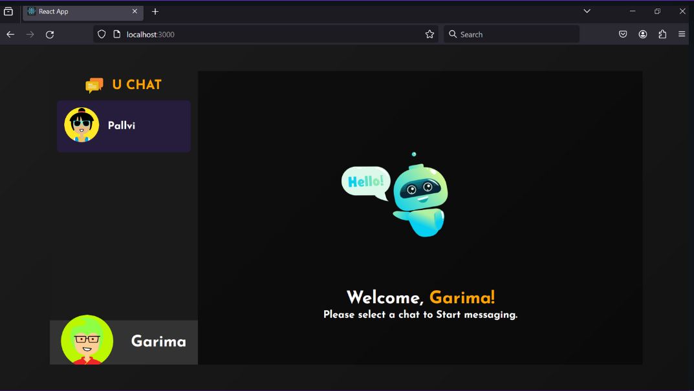

# U Chat

## 🌟 Welcome to U Chat
U Chat is a cool chat app made with the MERN stack, allowing you to chat with lots of people at once. You can make your profile special by adding your own picture. It's safe and easy to use with a simple login and registration system. But what makes U Chat really fun is that you can use lots of different emojis to express yourself. With its easy-to-use design, U Chat is more than just a chat app – it's a fun and friendly space where you can chat with friends and show off your personality.

## About Project

### Features and Interfaces

#### Home
- **Landing Page**: Lists all the features of the app.

#### Login and Authentication
- **Fast and secure authentication**: Uses JWT tokens to persist the authentication state.
- **Google Sign-In/Login**: Enables swift and secure access using Google credentials.

#### Chats
- **Conversation History**: View a comprehensive list of all your past chats, including details about whom you've chatted with and the timestamps of each conversation.
- **One-Click Conversations**: Initiate conversations effortlessly by simply clicking on any chat thread from the list.

#### Messages
- **Effortless Chatting**: Communicate with others through Socket.IO's seamless functionality.
- **Typing Indicator**: Stay informed with a typing indicator that signals whether the other person is currently typing.

#### Settings
- **Credential Updates**: Modify your credentials such as email and name.

#### Avatar 
- **Profile Picture Upload**: Upload your profile picture to personalize your account.

## Tech Stack

### Frontend
- ReactJS
- JavaScript
- Redux
- MaterialUI
- TailWindCSS

### Backend
- Node.js
- Express
- MongoDB

### Other Tools
- Socket.IO
- NPM Packages

### Open the App
- Open http://localhost:3000 with your browser to see the app.
